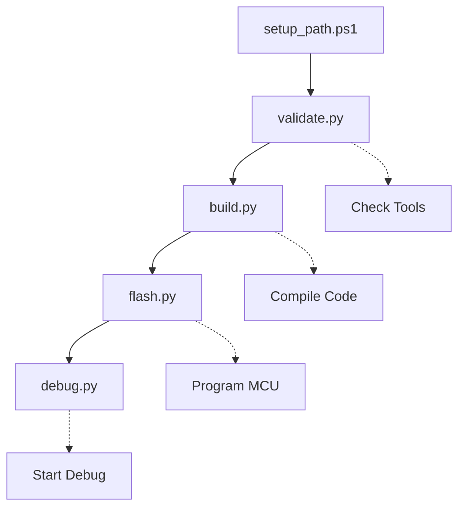

# 🛠️ Scripts Directory

This directory contains automation scripts for building, debugging, and managing the STM32 LoRa Gateway firmware project. All scripts are designed to work cross-platform (Windows, Linux, macOS).

> **📡 Project Status:** Currently implementing tag simulation features with 3-way command protocol (disable/IO/tag) and 48-tag support capacity. See [System Overview](../docs/architecture/SYSTEM_OVERVIEW.md) for latest features.

## 📁 **Scripts Overview**

| Script | Purpose | Platform | Usage |
|--------|---------|----------|-------|
| [`build.py`](#build-script) | Build STM32 firmware | All | `python scripts/build.py` |
| [`debug.py`](#debug-script) | Start debugging session | All | `python scripts/debug.py` |
| [`flash.py`](#flash-script) | Flash firmware to STM32 | All | `python scripts/flash.py` |
| [`validate.py`](#validate-script) | Check development environment | All | `python scripts/validate.py` |
| [`setup_path.ps1`](#setup-path-script) | Configure Windows PATH | Windows | `.\scripts\setup_path.ps1` |
| [`split_gateway_lora.sh`](#repository-split) | Split gateway_lora to new repo | Linux/macOS/Git Bash | `bash scripts/split_gateway_lora.sh` |
| [`cleanup_original_repo.sh`](#repository-cleanup) | Clean gateway_lora from fw-gateway | Linux/macOS/Git Bash | `bash scripts/cleanup_original_repo.sh` |
| [`install_gh_cli.sh`](#install-github-cli) | Install GitHub CLI | Windows/Git Bash | `bash scripts/install_gh_cli.sh` |

## 📦 **Repository Management**

### **Repository Split** {#repository-split}
`split_gateway_lora.sh` - Separate gateway_lora into independent repository

**Purpose:** Extract the `gateway_lora` (STM32F103) project into its own repository while preserving Git history.

**Usage:**
```bash
cd /c/Users/artur/fw-gateway
bash scripts/split_gateway_lora.sh
```

**What it does:**
1. ✅ Clones repository to temporary directory
2. ✅ Filters Git history to keep only gateway_lora files
3. ✅ Creates proper project structure
4. ✅ Generates README and .gitignore
5. ✅ Creates new GitHub repository (requires `gh` CLI)
6. ✅ Pushes code to new repository

**Requirements:**
- GitHub CLI (`gh`) - Install with `bash scripts/install_gh_cli.sh`
- Or create repository manually in GitHub

📖 **Full Guide:** [`REPOSITORY_SPLIT_GUIDE.md`](./REPOSITORY_SPLIT_GUIDE.md)

### **Repository Cleanup** {#repository-cleanup}
`cleanup_original_repo.sh` - Remove gateway_lora from original repository

⚠️ **Run only AFTER verifying the new repository works!**

**Usage:**
```bash
cd /c/Users/artur/fw-gateway
bash scripts/cleanup_original_repo.sh
```

**What it does:**
1. ✅ Removes `projects/gateway_lora` directory
2. ✅ Updates documentation with link to new repo
3. ✅ Creates backup of tasks.json
4. ✅ Commits changes (does NOT push automatically)

### **Install GitHub CLI** {#install-github-cli}
`install_gh_cli.sh` - Install and configure GitHub CLI on Windows

**Usage:**
```bash
bash scripts/install_gh_cli.sh
```

**Installation options:**
1. winget (recommended for Windows 10/11)
2. scoop
3. Manual download

**After installation:**
```bash
gh auth login
```

## 🔨 **Build Script**
`build.py` - Cross-platform STM32 firmware build system

### **Features:**
- ✅ Automatic toolchain detection
- ✅ Cross-platform make execution  
- ✅ Build optimization options
- ✅ Automatic versioning
- ✅ Clean build support
- ✅ Colored console output

### **Usage:**
```bash
# Basic build
python scripts/build.py

# Clean build
python scripts/build.py --clean

# Release build with optimization
python scripts/build.py --release

# Show help
python scripts/build.py --help
```

### **What it does:**
1. Validates toolchain (ARM GCC, make)
2. Generates version information  
3. Compiles firmware using optimized flags
4. Creates binary, hex, and ELF files
5. Reports build status and file sizes
6. Supports tag simulation features (0x00/0x01/0x02 command protocol)

## 🐛 **Debug Script**
`debug.py` - Cross-platform debugging utility

### **Features:**
- ✅ OpenOCD server management
- ✅ Automatic ST-Link detection
- ✅ GDB server startup
- ✅ Cross-platform executable paths
- ✅ Background process management

### **Usage:**
```bash
# Start debug session
python scripts/debug.py

# Start with custom config
python scripts/debug.py --config custom.cfg

# Stop running debug session
python scripts/debug.py --stop
```

### **What it does:**
1. Locates OpenOCD binary for current platform
2. Configures ST-Link interface
3. Starts OpenOCD server on port 3333
4. Provides GDB connection endpoint
5. Manages debug session lifecycle

## ⚡ **Flash Script**
`flash.py` - Cross-platform firmware flashing

### **Features:**
- ✅ Automatic firmware detection
- ✅ ST-Link programmer support
- ✅ Verify after programming
- ✅ Reset target after flash
- ✅ Multiple file format support (ELF, HEX, BIN)

### **Usage:**
```bash
# Flash latest firmware
python scripts/flash.py

# Flash specific file
python scripts/flash.py --file gateway_lora.hex

# Flash and verify
python scripts/flash.py --verify

# Erase and flash
python scripts/flash.py --erase
```

### **What it does:**
1. Locates firmware files in Debug directory
2. Connects to STM32 via ST-Link
3. Programs flash memory
4. Verifies programming success
5. Resets target to start execution

## ✅ **Validate Script**
`validate.py` - Development environment checker

### **Features:**
- ✅ Toolchain validation (ARM GCC, make, OpenOCD)
- ✅ ST-Link driver detection
- ✅ VS Code extension checks
- ✅ Python environment validation
- ✅ Project structure verification

### **Usage:**
```bash
# Full validation
python scripts/validate.py

# Quick check only
python scripts/validate.py --quick

# Generate report
python scripts/validate.py --report
```

### **What it checks:**
1. **Development Tools:**
   - ARM GCC compiler
   - GNU Make utility
   - OpenOCD debugger
   - ST-Link drivers

2. **VS Code Setup:**
   - Cortex-Debug extension
   - C/C++ extension
   - Task configuration

3. **Project Structure:**
   - Source code integrity
   - Build configuration
   - Debug setup

## 🪟 **Setup Path Script (Windows)**
`setup_path.ps1` - Windows PATH configuration

### **Features:**
- ✅ Permanent PATH modification
- ✅ System-wide or user-level installation
- ✅ Administrator privilege handling
- ✅ GnuWin32 make integration
- ✅ Automatic validation

### **Usage:**
```powershell
# Interactive setup (recommended)
.\scripts\setup_path.ps1

# Force system-wide installation
.\scripts\setup_path.ps1 -Force

# User-level installation
.\scripts\setup_path.ps1 -User
```

### **What it does:**
1. Detects GnuWin32 make installation
2. Adds make to system/user PATH
3. Validates PATH modification
4. Provides installation feedback

## 🚀 **Quick Start Guide**

### **Initial Setup:**
```bash
# 1. Validate environment
python scripts/validate.py

# 2. Build firmware (or use VS Code task)
python scripts/build.py
# OR: Ctrl+Shift+P → "Tasks: Run Task" → "Build STM32 Project"

# 3. Flash to device
python scripts/flash.py
# OR: Ctrl+Shift+P → "Tasks: Run Task" → "Flash STM32"

# 4. Start debugging (optional)
python scripts/debug.py
# OR: Press F5 → "🚀 STM32 Debug (Recommended)"
```

### **Development Workflow:**
```bash
# Make code changes, then:
python scripts/build.py --clean    # Clean build
python scripts/flash.py            # Flash new firmware
python scripts/debug.py            # Debug if needed
```

### **VS Code Integration:**
The scripts are integrated with VS Code tasks and can be run via:
- **Build:** `Ctrl+Shift+P` → `Tasks: Run Task` → `Build STM32 Project`
- **Clean:** `Ctrl+Shift+P` → `Tasks: Run Task` → `Clean STM32 Project`  
- **Flash:** `Ctrl+Shift+P` → `Tasks: Run Task` → `Flash STM32`
- **Debug:** `F5` → Select debug configuration

## 🔧 **Configuration**

### **Environment Variables:**
```bash
# Optional: Override default paths
export ARM_TOOLCHAIN_PATH="/custom/path/to/arm-gcc"
export OPENOCD_PATH="/custom/path/to/openocd"
export STLINK_PATH="/custom/path/to/stlink"
```

### **Script Configuration:**
Most scripts auto-detect paths, but you can modify the following variables in each script:
- `TOOLCHAIN_PREFIX` - ARM GCC prefix (default: `arm-none-eabi-`)
- `BUILD_DIR` - Build output directory (default: `gateway_lora/Debug`)
- `TARGET_NAME` - Firmware name (default: `gateway_lora`)

### **Current Project Structure:**
```
gateway-lora-firmware/
├── scripts/           # ← You are here
│   ├── build.py      # Build automation
│   ├── debug.py      # Debug utilities  
│   ├── flash.py      # Flashing tools
│   ├── validate.py   # Environment validation
│   └── setup_path.ps1 # Windows PATH setup
├── gateway_lora/     # STM32CubeMX project
│   └── Debug/        # Build output directory
├── tools/            # OpenOCD and utilities
└── .vscode/          # VS Code configuration
    ├── tasks.json    # Build/flash tasks
    └── launch.json   # Debug configurations
```

## 🐞 **Troubleshooting**

### **Common Issues:**

#### **"make: command not found" (Windows)**
```bash
# Option 1: Install GnuWin32 make, then run:
./scripts/setup_path.ps1

# Option 2: Use Git Bash (recommended for this project)
# Make sure you're using bash.exe as your terminal

# Option 3: Use VS Code tasks instead:
# Ctrl+Shift+P → Tasks: Run Task → Build STM32 Project
```

#### **"arm-none-eabi-gcc: command not found"**
```bash
# Install ARM GCC toolchain and add to PATH
# Or set ARM_TOOLCHAIN_PATH environment variable
```

#### **"OpenOCD not found"**
```bash
# Check if tools/bin/openocd.exe exists
# Or install OpenOCD system-wide
```

#### **ST-Link connection failed**
```bash
# Check USB connection
# Install ST-Link drivers from: https://www.st.com/en/development-tools/stsw-link009.html
# Try different USB port
# Check if STM32 is in bootloader mode

# Alternative: Use VS Code debugging instead
# Press F5 → Select "🚀 STM32 Debug (Recommended)"
```

#### **Build fails with path issues**
```bash
# Make sure you're in the correct workspace:
cd /c/Users/artur/development/gateway-lora-firmware

# Use VS Code tasks for reliable builds:
# Ctrl+Shift+P → Tasks: Run Task → Build STM32 Project

# Or use Python scripts with full paths:
python /c/Users/artur/development/gateway-lora-firmware/scripts/build.py
```

### **Debug Mode:**
Add `--verbose` or `--debug` flag to any script for detailed output:
```bash
python scripts/build.py --verbose
python scripts/debug.py --debug
```

## 📊 **Script Dependencies**



## 📝 **Adding New Scripts**

When adding new scripts to this directory:

1. **Follow naming convention:** `action.py` or `setup_feature.ps1`
2. **Include cross-platform support** using `platform.system()`
3. **Add colored output** using the Colors class
4. **Include help/usage information**
5. **Update this README** with the new script information

### **Script Template:**
```python
#!/usr/bin/env python3
"""
Description of what this script does
Works on Windows, Linux, and macOS
"""

import os
import sys
import platform
from pathlib import Path

# Colors for console output
class Colors:
    RESET = '\033[0m'
    RED = '\033[31m'
    GREEN = '\033[32m'
    YELLOW = '\033[33m'
    BLUE = '\033[34m'

def color_text(text, color):
    return f"{color}{text}{Colors.RESET}"

def main():
    print(color_text("🔧 Script Name", Colors.GREEN))
    # Your script logic here
    
if __name__ == "__main__":
    main()
```

## 🎯 **Related Documentation**

- [Build System Guide](../docs/development/BUILD_SYSTEM.md)
- [Debugging Guide](../docs/development/DEBUGGING.md)  
- [Setup Guide](../docs/development/SETUP_GUIDE.md)
- [OpenOCD Guide](../docs/tools/OPENOCD_GUIDE.md)
- [Quick Start Guide](../docs/QUICK_START.md)
- [System Overview](../docs/architecture/SYSTEM_OVERVIEW.md)

## 🔗 **VS Code Integration**

These scripts work seamlessly with VS Code:

### **Tasks (Ctrl+Shift+P → Tasks: Run Task)**
- `Build STM32 Project` - Equivalent to `python scripts/build.py`
- `Clean STM32 Project` - Equivalent to `python scripts/build.py --clean`
- `Flash STM32` - Equivalent to `python scripts/flash.py`

### **Debug Configurations (F5)**
- `🚀 STM32 Debug (Recommended)` - Full debug with auto-build
- `🔗 STM32 Attach (External OpenOCD)` - Attach to running session
- `🛠️ STM32 Debug (Manual GDB)` - Advanced debugging

### **Command Palette**
- `Developer: Reload Window` - If build environment changes
- `Tasks: Show Running Tasks` - Monitor active builds
- `Debug: Start Debugging` - Alternative to F5

---

*For issues or improvements, please check the main project documentation or create an issue in the project repository.*
